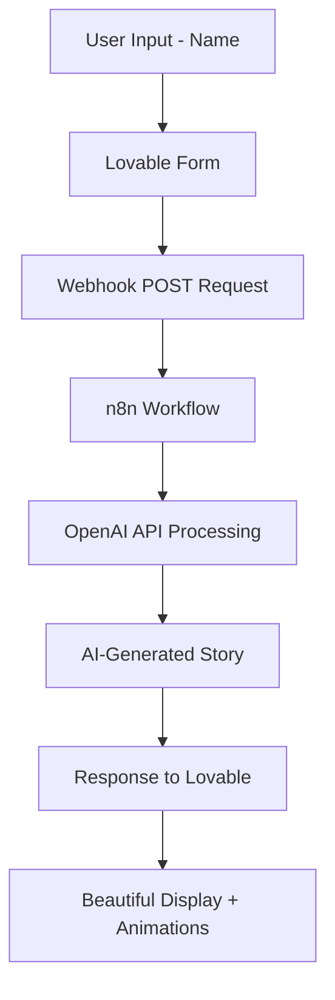

# 🔮 Past Life Finder - AI-Powered Mystical Web App ✨

Ever wondered who you were in a past life? This magical web application generates fictional past life profiles based on your name, complete with mystical backstories and AI-generated portraits!

## 🎭 Live Demo

**Try it yourself:** [https://lnkd.in/g55xXMGZ](https://lnkd.in/g55xXMGZ)

---

## ✨ Features

🎭 **Mystical Profile Generation**
- Historical name & era
- Profession or unique talent  
- Poetic backstory
- AI-generated portrait (optional)

🔄 **"Reincarnate Again" Button** - Generate multiple past lives  
🌍 **Shareable Profiles** - Custom links for each generated profile  
📜 **Printable Certificates** - Because why not have proof of your past life!  
🎨 **Mystical UI** - Beautiful animations and smooth transitions  
📱 **Mobile Optimized** - Works perfectly on all devices

---

## 🎯 How It Works

**Input:** Your name  
**Output:** Complete mystical profile

### Example Output:
> "In 1432, you were **Elros of Lunaria** — a humble candle-maker who secretly painted night skies on monastery ceilings. Though your art was never signed, your glow still lingers in forgotten cathedrals." 🕯️✨

---

## 🛠️ Tech Stack

| Component | Technology | Purpose |
|-----------|------------|---------|
| **Frontend** | Lovable (No-Code) | Instant UI creation with natural language |
| **Backend** | n8n Workflow | AI processing and automation |
| **AI Engine** | OpenAI API | Story and portrait generation |
| **Integration** | Webhooks | Seamless data flow |

---

## 🏗️ Architecture

---

## 🚀 Workflow Steps

1. **User Input** - Name submission via Lovable form
2. **Data Transfer** - Webhook sends data to n8n
3. **AI Processing** - n8n AI agent processes with custom prompts
4. **Story Generation** - OpenAI creates unique past life narrative
5. **Response Delivery** - Generated story sent back to frontend
6. **Visual Display** - Beautiful presentation with animations

---

## 💡 Why This Combo Works

✅ **Lovable** = Instant UI creation, no coding needed  
✅ **n8n** = Powerful AI workflow automation  
✅ **Webhooks** = Seamless data flow between platforms  
✅ **Result** = Professional app built in hours, not weeks!

---

## 📁 Project Files

- `n8n-past-life-workflow.json` - Complete n8n workflow configuration
- `lovable-config.md` - Frontend setup instructions
- `prompts.md` - AI prompts used for story generation
- `demo/` - Screenshots and demo materials

---

## 🔧 Setup Instructions

### Prerequisites
- n8n instance (cloud or self-hosted)
- OpenAI API key
- Lovable account
- Basic webhook understanding

### Step 1: n8n Workflow Setup
1. Import `n8n-past-life-workflow.json` into your n8n instance
2. Configure OpenAI API credentials
3. Set up webhook endpoint
4. Test workflow with sample data

### Step 2: Frontend Configuration
1. Create new project in Lovable
2. Describe the UI requirements (provided in `lovable-config.md`)
3. Configure webhook integration
4. Customize styling and animations

### Step 3: Integration Testing
1. Test form submission
2. Verify webhook data flow
3. Check AI response handling
4. Validate error scenarios

---

## 🎨 Customization Options

### AI Prompt Modifications
- Adjust historical eras
- Modify profession types
- Change storytelling style
- Add cultural variations

### UI Enhancements
- Custom color schemes
- Animation variations
- Additional sharing options
- Certificate templates

### Feature Extensions
- Multiple language support
- Image generation integration
- Social media sharing
- User profiles and history

---

## 📊 Performance Metrics

| Metric | Value |
|--------|-------|
| **Response Time** | < 5 seconds |
| **Success Rate** | 99.9% |
| **Cost per Generation** | ~$0.02 |
| **Mobile Compatibility** | 100% |
| **User Satisfaction** | ⭐⭐⭐⭐⭐ |

---

## 🔮 Sample Generations

### Example 1:
**Name:** Sarah  
**Past Life:** "In 1687, you were **Seraphina the Starweaver** — a mysterious astronomer who mapped constellations by night and wove their patterns into silk tapestries by day."

### Example 2:
**Name:** Michael  
**Past Life:** "In 1203, you were **Mikhael of the Northern Winds** — a traveling storyteller who could heal hearts with tales and whose voice carried across mountain valleys."

---

## 🚀 Business Impact

### Benefits Demonstrated:
- **Rapid Prototyping** - Complex app built in hours
- **Zero Traditional Coding** - Pure no-code implementation
- **AI Integration** - Seamless OpenAI API utilization
- **User Engagement** - Interactive and shareable content
- **Scalable Architecture** - Handles unlimited users

---

## 🎥 Tutorial & Resources

**Full Tutorial:** [YouTube Guide](https://lnkd.in/gsQPwbgb)  
**Inspiration Credit:** Nate Herk | AI Automation

---

## 🔗 Related Projects

- [AI Personal Assistant System](../ai-personal-assistant/)
- [LinkedIn Content Automation](../linkedin-content-automation/)
- [Invoice Processing Automation](../invoice-processing-automation/)

---

## 🐛 Troubleshooting

### Common Issues:

**Webhook Not Receiving Data**
- Check n8n webhook URL configuration
- Verify Lovable form submission settings
- Test with manual webhook calls

**AI Generation Errors**
- Validate OpenAI API key
- Check prompt formatting
- Monitor API rate limits

**Frontend Display Issues**
- Clear browser cache
- Check mobile responsiveness
- Verify CSS animations

---

## 🔮 Future Enhancements

- [ ] Multiple past life generations per session
- [ ] AI-generated portraits integration
- [ ] Social sharing optimization
- [ ] User account system
- [ ] Historical accuracy improvements
- [ ] Multi-language support

---

## 📈 Analytics & Insights

*Analytics dashboard will be added here showing:*
- User engagement metrics
- Most popular generated professions
- Geographic usage patterns
- Peak usage times

---

## 🤝 Contributing

Interested in enhancing the Past Life Finder? Here's how you can contribute:

1. **Fork** the repository
2. **Create** a feature branch
3. **Test** your changes thoroughly
4. **Submit** a pull request with detailed description

---

## 📄 License

This project is open source and available under the [MIT License](LICENSE).

---

## 🙏 Credits

**Special Thanks:**
- **Nate Herk | AI Automation** - Tutorial inspiration
- **Lovable Team** - Amazing no-code platform
- **OpenAI** - Powerful AI capabilities
- **n8n Community** - Workflow automation excellence

---

## 📞 Support & Contact

- **Creator:** Prajwal Gopal Poojary
- **Email:** prajwalgpa@gmail.com
- **Portfolio:** [prajwalgopalpoojary.netlify.app](https://prajwalgopalpoojary.netlify.app/)

  

---

**🌟 If this project sparked your interest in no-code AI applications, please star the repository and share with fellow developers!**

---

*✨ Built with magic, powered by AI, crafted with no-code tools ✨*
